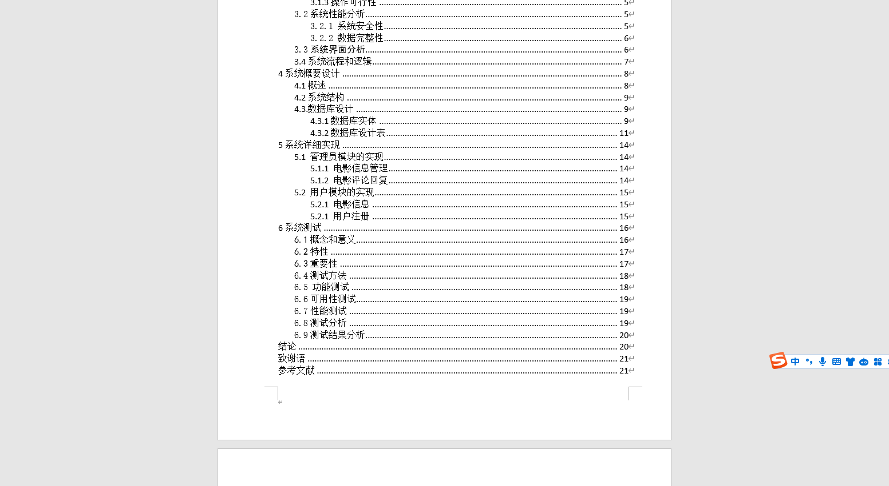
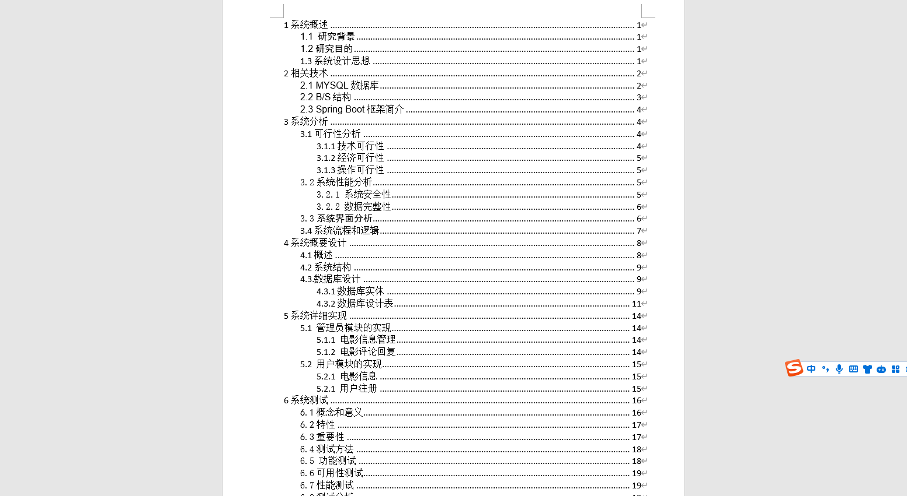
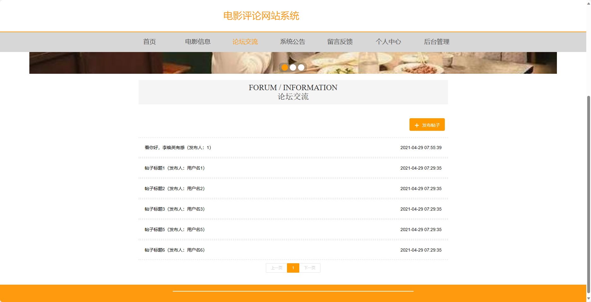
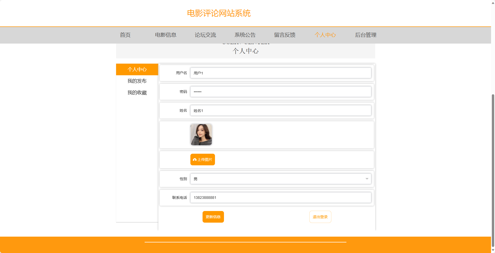
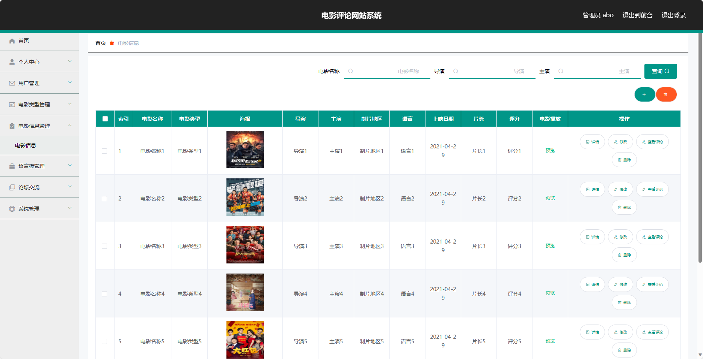
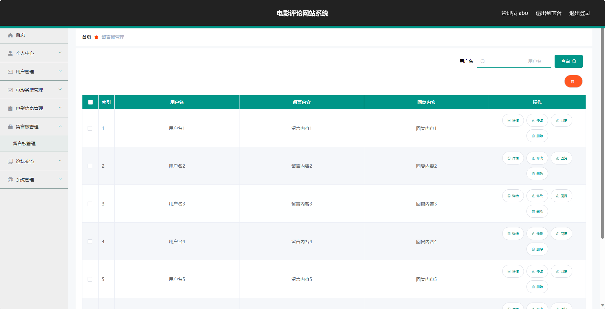
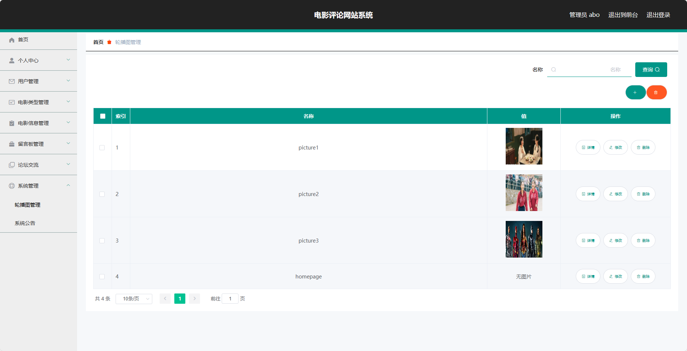

基于SpringBoot的电影评论网站系统（程序+论文）
=
- 完整代码获取地址：从戎源码网 ([https://armycodes.com/](https://armycodes.com/))
- 作者微信：19941326836  QQ：952045282 
- 承接计算机毕业设计、Java毕业设计、Python毕业设计、深度学习、机器学习
- 选题+开题报告+任务书+程序定制+安装调试+论文+答辩ppt 一条龙服务
- 所有选题地址https://github.com/nature924/allProject

一、项目介绍
---
基于Spring Boot框架实现的电影评论网站系统，系统包含两种角色：管理员、用户,系统分为前台和后台两大模块，主要功能如下。

### 前台：
1. 首页：展示网站的基本信息和推荐电影等内容。
2. 电影信息：提供各个电影的详细信息，包括电影简介、演员阵容、上映日期等。
3. 论坛交流：提供用户之间的交流平台，可以分享观影心得、讨论电影话题等。
4. 系统公告：发布最新的系统公告和电影相关的消息。
5. 留言反馈：用户可以留下反馈意见或提出问题。
6. 个人中心：用户可以查看和编辑个人信息，包括个人资料、收藏记录等。

### 后台：
### 管理员：
1. 个人中心：管理员可以管理自己的个人信息和权限。
2. 用户管理：对用户信息进行管理，包括添加、修改和删除用户信息。
3. 电影类型管理：管理电影的类型，包括添加、修改和删除电影类型。
4. 电影信息管理：管理电影的详细信息，包括添加、修改和删除电影信息。
5. 留言板管理：管理用户的留言板，包括审核和删除留言。
6. 论坛交流：管理员可以管理论坛交流区，包括审核和删除帖子。
7. 系统管理：管理系统的参数设置和日志记录。

### 用户：
1. 个人中心：用户可以查看和编辑个人信息。
2. 我的收藏管理：用户可以查看和管理自己的收藏电影，包括添加、删除收藏。

二、项目技术
---
- 编程语言：Java
- 数据库：MySQL
- 项目管理工具：Maven
- 前端技术：VUE、HTML、Jquery、Bootstrap
- 后端技术：Spring、SpringMVC、MyBatis

三、运行环境
---
- 操作系统：Windows、macOS都可以
- JDK版本：JDK1.8以上都可以
- 开发工具：IDEA、Ecplise、Myecplise都可以
- 数据库: MySQL5.7以上都可以
- Tomcat：任意版本都可以
- Maven：任意版本都可以

四、运行截图
---
### 论文截图：

### 程序截图：

